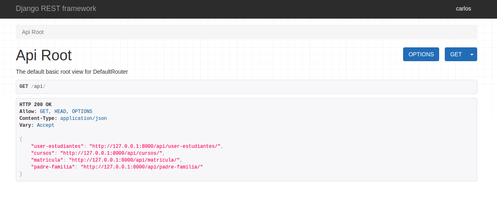
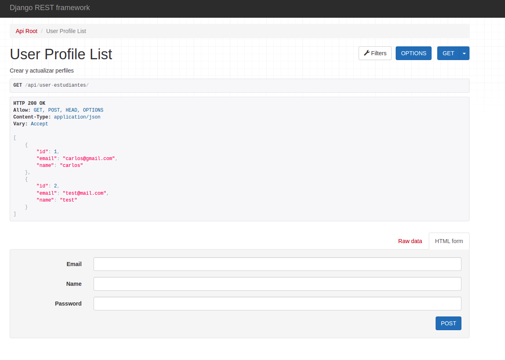

# REST-API-django

Estructura back-end para un sistema básico de cursos online con REST-API-django.



### Installation

```
git clone https://github.com/carjizo/REST-API-django.git
```

#### Ingresa a la carpeta

```
cd system-ecommerce
```

#### Crea y activa el entorno virtual(linux)

```
python3 -m venv venv

source venv/bin/activate
```

#### Intala el archivo requirements.txt

```
pip install -r requirements.txt

```

#### Hacer las migraciones y crear un super usuario(correo, name, password)

```
python3 manage.py makemigrations profiles_api

python3 manage.py migrate

python3 manage.py createsuperuser

```

puedes visitar e iniciar sesion <a href="http://127.0.0.1:8000/admin/" target="_blank">http://127.0.0.1:8000/admin/</a>

ahora puedes visitar e interactuar con la api <a href="http://127.0.0.1:8000/api/" target="_blank">http://127.0.0.1:8000/api/</a>

### User Profile List


